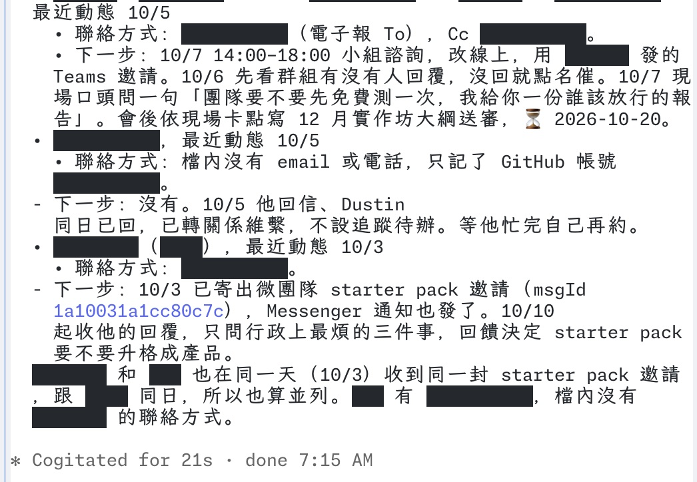

# claude-mods

Claude Code 的 function-hooks mods。目前收錄一支：**screen-guard**，上課或開會分享螢幕時，把 Claude Code 對話裡的人名、公司名、金鑰、聯絡方式換成黑色遮罩條，點一下才解開。

**English summary** — A Claude Code mod that redacts names, organisations, secrets and contact details in the transcript while you screen-share. It only changes what is drawn: the model still reads the original text. Masks are solid bars you can click to reveal. Detection is local regex first; ambiguous names are judged by TypeSafe JEV in the cloud, or by a local Ollama model when the text must not leave the machine. Tuned for Traditional Chinese (Taiwan) mixed with English.



上圖是實際畫面：人名、公司、Email、帳號都換成黑條，一般說明文字照常顯示。

---

## screen-guard 做什麼

```
回覆要畫到畫面上
   |
   v
本機規則偵測（約 1.5 萬字 5ms）
   |-- 一定要遮：金鑰、Email、電話、身分證、地址、詞表裡的名字 --> 直接遮
   |-- 可能是名字：中文姓名、「王經理」、公司全名、夾在中文旁的英文名 --> 先遮
   |                                                   |
   |                       背景批次送去判讀 <-----------+
   |                       判定不是敏感資訊才放出來，結果存快取
   v
畫面：黑色遮罩條，點一下解開那個詞
```

- **只改畫面**：模型讀到的、存進對話紀錄的都是原文。學員看不到，你的工作不受影響。
- **Claude 自己也會標**：遮蔽開啟時，mod 在系統提示加一段，請 Claude 把回覆裡的私人姓名與組織包成 `⟦…⟧`。畫面上這些一律變黑條，括號不會出現；寫檔、跑指令前會自動剝掉括號，不會寫進檔案。模型讀得懂上下文，綽號、簡稱這類規則抓不到的也能遮。工具輸出（讀檔、指令結果）模型碰不到，那部分仍靠下面的偵測。
- **不確定就遮**：第一時間就是遮好的，不等網路；判讀失敗、逾時都維持遮蔽。
- **遮的範圍**：Claude 的回覆、你的提問、工具呼叫的參數與結果、折疊的工具群組。

## 安裝

```bash
claude plugin marketplace add danyuchn/claude-mods
claude plugin install screen-guard@dustin-mods
```

在 Claude Code 裡打 `/mask on` 開啟。開關狀態會保留到下一次 session。

## 指令

| 指令 | 作用 |
|---|---|
| `/mask` | 開／關切換 |
| `/mask on`、`/mask off` | 直接開或關 |
| `/mask local` | 只用本機模型判讀，文字不出這台機器 |
| `/mask cloud` | 改回 JEV 判讀（失敗時自動退回本機） |
| `/mask reset` | 把點開過的詞全部遮回去 |
| `/mask reload` | 重讀詞表與 local-only 清單 |

## 設定

兩份設定都放在你自己的家目錄，不在 repo 裡。範本在 [`screen-guard/examples/`](screen-guard/examples/)。

| 檔案 | 內容 |
|---|---|
| `~/.config/screen-guard/terms.txt` | 一行一個詞，一律遮；`!` 開頭的永遠不遮（例如 `!Claude Code`） |
| `~/.config/screen-guard/local-only.txt` | 一行一個資料夾路徑；在這些資料夾裡開的 session 只用本機模型判讀 |

環境變數：

| 變數 | 用途 |
|---|---|
| `TYPESAFE_API_KEY` | TypeSafe JEV 金鑰。沒有就全部走本機模型 |
| `SCREEN_GUARD_OLLAMA_MODEL` | 本機判讀用的 Ollama 模型，預設 `qwen3.6:35b-a3b` |

## 判讀與隱私

| 路徑 | 速度（實測） | 資料去哪 |
|---|---|---|
| JEV（預設） | 40 個候選詞一批約 0.5 秒 | 候選詞與前後各 60 字送到 TypeSafe |
| 本機 Ollama | 40 個候選詞約 7.8 秒（M4 Pro） | 不出這台機器 |

客戶資料不能送第三方時，把那個客戶的資料夾加進 `local-only.txt`。詞表比對永遠在本機進行，最敏感的名字直接寫進詞表，不必靠模型判斷。

## 已知限制

- **點擊解開只在全螢幕模式有效**：一般模式下黑條照樣會畫，但點不開。
- **表格或程式碼區塊裡有遮罩時**，整塊會改成原始文字逐行列出，表格框線不會畫出來。
- **你自己的輸入框、權限確認對話框、其他 App** 都遮不到。
- **工具呼叫列與你的提問**也會遮，但黑條點不開（那幾處是 Claude Code 自己畫的）。
- 偶爾回覆剛串流完的那一刻沒套用遮蔽，下一次重畫就正常。上課前先問一題，確認黑條有出來。
- 中文人名偵測靠姓氏與稱謂規則，罕見姓氏可能漏抓。重要的名字請寫進詞表。

## 未來開發路線

- **支援 Claude Desktop App**：遮罩元件已在 desktop surface 跑過自動測試，尚未在 Desktop App 實機驗證點擊與排版。
- 表格內的遮罩維持表格排版。
- 中文人名改用本機 NER 模型偵測，降低對姓氏規則的依賴。
- 剛開啟遮蔽後的第一則回覆，Claude 可能還沒套用標記指示（偵測層仍會遮）。
- 詞表管理介面：在 Claude Code 裡直接把詞加入遮蔽或放行清單。

## 開發

```bash
claude plugin validate screen-guard
claude plugin test screen-guard
```

測試全部使用虛構資料。偵測規則在 [`screen-guard/hooks/detect.ts`](screen-guard/hooks/detect.ts)，畫面與判讀在 [`screen-guard/hooks/register.tsx`](screen-guard/hooks/register.tsx)。台灣身分證、電話、地址等規則移植自 [pii-guard](https://github.com/danyuchn/pii-guard)。

## 授權

MIT
