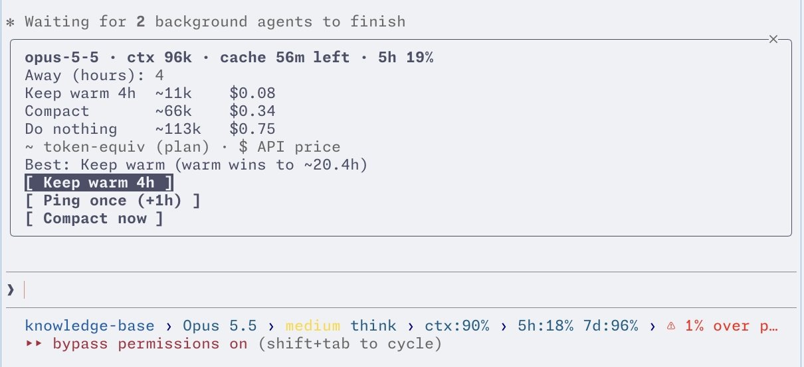

# claude-cache-panel

A quiet [Claude Code](https://claude.com/claude-code) mod that tells you when your prompt cache is about to go cold, and lets you decide in one click what to do about it: **keep it warm**, **ping it once**, or **compact the conversation**, with live cost estimates for each.

It does nothing until you have been idle for 50 minutes. No auto mode, no background spending you did not ask for.



*The panel on a 96k-token Opus 5.5 conversation: keeping warm for 4 hours costs about $0.08, compacting $0.34, doing nothing $0.75.*

The reminder sound is herdr's "done" chime, the one that goes with the green dot in the [herdr](https://herdr.dev) agents sidebar.

## Why

Claude Code's prompt cache lasts one hour. Come back after 61 minutes to a 300k-token conversation and the whole thing is re-written at the (much higher) cache-write price. Most of the time that does not matter. When you know you are about to be away for a while, it does.

Existing cache keep-alive tools run on a timer all the time. This one is built for a different habit: *ignore the cache normally, think about it only when I am leaving.*

## What you get

**Normally:** nothing on screen, nothing spent.

**After 50 idle minutes** (cache still warm, context large enough to be worth saving):

- one short line above the prompt: `[ cache cools in 10m ]` (a clickable button; shortened to `[ cache 10m ]` in narrow panes)
- a herdr notification with the "done" sound, body = your folder name
- it disappears when you type again or when the cache goes cold; ignore it and nothing happens

**Click the button, or type `/warm`**, to open a small panel (keyboard: Up/Down + Enter; mouse works too):

| Control | What it does |
| --- | --- |
| Away (hours) | How long you will be gone. Blank = 4. |
| Cost rows | Keep warm vs. Compact vs. Do nothing, for that many hours. |
| `Best:` line | The cheapest option, and how many hours keep-warm stays ahead. |
| **Keep warm** | Pings every 50 minutes until the window ends. |
| **Ping once** | One ping, about one more hour of warmth. |
| **Compact now** | Runs the built-in `/compact`. |

While warming, the band shows `[ warm 3h58m ]`. Typing does **not** stop it. When the window ends you get a one-line toast that dismisses itself. `/warm off` stops early.

## How keep-warm works

Every 50 minutes the mod sends a tiny hidden request (`Reply with exactly: ok`) with `$.model.fork`, which answers over the *same conversation prefix*. The server serves it from your existing cache and restarts the one-hour timer. The request never appears in your transcript and does not grow your context.

Measured on Claude Code 2.1.289 with the cache TTL temporarily shortened to 5 minutes:

- ping 190 s after the last turn, then a real turn at 395 s (95 s past the TTL)
- that turn read 96,093 cached tokens and wrote 43, so the ping did extend the main conversation's cache

Caveat: in a brand-new session (about one turn old) the *first* ping writes a fresh cache entry instead of reading yours, so it costs like one rewrite; later pings read it normally. The mod tolerates one such miss and stops after two in a row.

## When is it worth reminding you?

The reminder only fires when letting the cache go cold would cost at least about **$0.30** (API-equivalent), with a floor of 30k context tokens. Examples:

| Model | Reminder threshold |
| --- | --- |
| Opus 5 | ~31.6k tokens |
| Opus 5.5 | ~38.5k tokens |
| Sonnet 5.5 | ~78.9k tokens |
| Haiku 4.5 | ~157.9k tokens |
| Fable 5.1 | 30k (floor) |

Cost estimates use two bases and pick automatically: API list prices, or, when your account reports subscription rate limits, community-measured quota weights (cache read 0.028, 1h write 1.2, output 5, as multiples of one plain input token). The subscription weights were measured on only two models and are applied to the rest, so treat them as approximate. Prices were checked against the official pricing page on 2026-10-04; edit `hooks/model.ts` if they change.

## Install

Requires Claude Code **2.1.287 or newer** (the version that introduced mods). Developed and tested on 2.1.289 on macOS.

```bash
git clone https://github.com/danyuchn/claude-cache-panel.git
```

Try it for one session:

```bash
claude --plugin-dir /path/to/claude-cache-panel
```

Load it in every session by adding to `~/.claude/settings.json`:

```json
{
  "env": {
    "CLAUDE_CODE_PLUGIN_DIRS": "/path/to/claude-cache-panel"
  }
}
```

If you already use `CLAUDE_CODE_PLUGIN_DIRS`, add the path to your existing list instead of replacing it.

Check the mod loads: `claude plugin validate /path/to/claude-cache-panel`.

### The sound needs herdr

The notification goes through `herdr notification show`, so you get sound only inside a [herdr](https://herdr.dev) pane (the mod checks `HERDR_ENV=1`). Outside herdr you still get the on-screen button, just no sound.

### Try the whole flow in a few minutes

```bash
CACHE_PANEL_FAST=1 claude --plugin-dir /path/to/claude-cache-panel
```

Fast mode reminds after 1 minute, pings every 2 minutes, and skips the context threshold. Send one message, wait a minute, and the button appears. Do not leave this mode on.

## Limitations

- Only verified in the terminal. The panel guards on the terminal and desktop surfaces, but the desktop app has not been tested.
- The full one-hour path has not been waited out end to end; the mechanism was proven with a 5-minute TTL.
- `claude plugin test` may refuse to run on your account if the mods rollout flag is off (it did on mine). `tests/model.test.ts` holds the cost-model assertions; the same checks run fine under plain Deno.
- Subscription cost weights are approximate (see above).
- The herdr sound was confirmed to be *sent* (`shown: true`); whether it matches your ear is up to your herdr settings.

## Roadmap

- **Desktop version.** A Claude Code Desktop build of the panel, with native notifications and the same keep-warm / ping / compact choices. This is the next major item.
- Notification backends beyond herdr (terminal bell, OS notifications), selectable in options.
- Configurable thresholds, ping interval, and default away hours via mod options.
- Verified end-to-end run at the real one-hour TTL, and a cold-cache panel walkthrough.
- Measured subscription weights for more models.

Ideas and pull requests are welcome.

## Layout

```
.claude-plugin/plugin.json   manifest
hooks/hooks.json             points at the module
hooks/register.tsx           events, timers, band + panel UI
hooks/model.ts               pure cost model (no engine calls)
types/index.d.ts             shape of the mod's $.state values
tests/model.test.ts          cost-model assertions
```

## License

MIT
